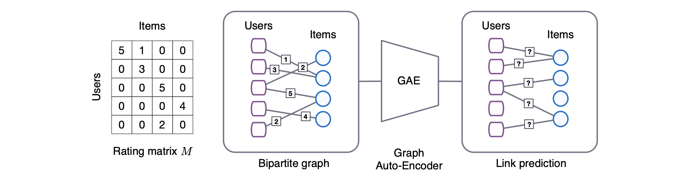
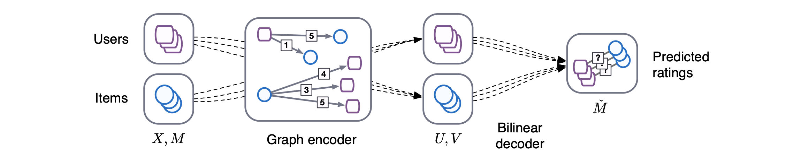

# Graph Convolutional Matrix Completion based on Pytorch
PyTorch and PyTorch geometric based implementation of [Graph Convolutional Matrix Completion](https://arxiv.org/abs/1706.02263).





## Note
This repository is **NOT** an official implementation of that paper.  
The official implementation is [this](https://github.com/riannevdberg/gc-mc) (Tensorflow).  
Our experimental result is shown below and it doesn't reach to the score of the original paper.

## Setup
- Setup a virtual environment of python 3.6 or newer
- Install requirements (pip)
  ```
  pip install -r requirements/1.txt
  pip install --verbose --no-cache-dir -r requirements/2.txt
  pip install -r requirements/3.txt
  ```

Installation of Pytorch Geometric is very troublesome and may destroy your python environment.  
So, we recommend to use the virtual environment (e.g. pyenv, virtualenv, pipenv, etc.).  
Please see [Pytorch Geometirc document](https://rusty1s.github.io/pytorch_geometric/build/html/notes/installation.html) for more details.  


## Train and Test
```
python main.py
```
- Configuration:  
The settings for train and test are in `config.yml`.  

- Dataset:  
Default training dataset is MovieLens-100k which will be automatically downloaded in `data/` when running `main.py`.


## Results
Note that the score of this repo donesn't reach to the original one.

| | Test RMSE |
|:--|--:|
| Ours | 0.968 |
| Original | 0.910 |
